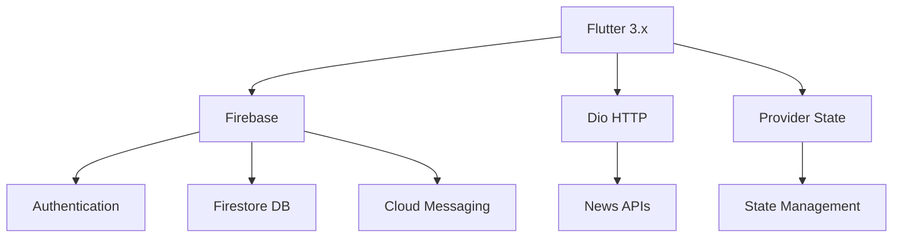

# 📱 Aplikasi Berita - Portal Berita Modern Flutter

**Aplikasi Berita** adalah solusi terdepan untuk mengakses berita terkini dengan antarmuka elegan, fitur lengkap, dan performa optimal. Dibangun dengan Flutter untuk pengalaman lintas platform yang mulus.

*(Tampilan utama aplikasi dengan desain modern)*

---

## ✨ Fitur Unggulan

### 🗞️ Konten Berkualitas
- 📰 100+ sumber berita terpercaya (nasional & internasional)
- 🗂️ Kategori lengkap: Politik, Bisnis, Teknologi, Hiburan, Olahraga, Kesehatan
- ⚡ Pembaruan real-time dengan sistem notifikasi push
- 🎯 Konten yang dipersonalisasi berdasarkan preferensi

### 🛠️ Pengalaman Pengguna
- 🌗 Dark/Light mode otomatis (sesuai preferensi sistem)
- 🔍 Pencarian cerdas dengan filter multi-kriteria
- 📱 Desain responsif untuk berbagai ukuran layar

### 🔄 Interaksi Sosial
- 💬 Sistem komentar bertingkat dengan reaksi
- 📌 Bookmark dengan kategori custom
- 🤝 Berbagi ke 20+ platform media sosial
- 👤 Profil pengguna dengan riwayat bacaan

---

## 📸 Galeri Aplikasi

| Fitur | Tampilan |
|-------|----------|
| **Beranda Personalisasi** |  |
| **Pembaca Artikel** |  |
| **Manajemen Bookmark** |  |
| **Profil Pengguna** |  |
| **Sistem Komentar** |  |

---

## 🚀 Instalasi Mudah

### 📱 Android
1. 📥 Download APK terbaru dari [halaman Releases](https://github.com/Maftuuh1922/aplikasi_berita/releases)
2. ⚙️ Aktifkan **Instalasi dari Sumber Tidak Dikenal** di pengaturan Android
3. 🖱️ Tap file APK untuk memulai instalasi
4. 🎉 Buka aplikasi dan mulai jelajahi berita terkini!

### 🔮 Coming Soon
- 🍏 **iOS App Store** - Dalam pengembangan
- 🌐 **Versi Web PWA** - Tahap perencanaan
- 🖥️ **Desktop App** - Konsep awal

---

## 👥 Tim Pengembang

| | **Muhammad Maftuh** | **Rival Rudiana** | **Ridwan Syahini** |
|:---:|:---:|:---:|:---:|
| **Role** | Lead Flutter Developer | UI/UX Designer | Backend Engineer |
| **GitHub** | [@Maftuuh1922](https://github.com/Maftuuh1922) | [@rivalrudiana1](https://github.com/rivalrudiana1) | [@rdwnsyh](https://github.com/rdwnsyh) |
| **Fokus** | Arsitektur & Performance | Design System | API Integration |

### 🏆 Kontribusi
- **Muhammad Maftuh**: Arsitektur aplikasi, state management, optimisasi performa
- **Rival Rudiana**: Design system, user experience, prototype & testing  
- **Ridwan Syahini**: API integration, database design, infrastruktur backend

---

## 🛠️ Teknologi Utama

### Tech Stack:
- **Frontend**: Flutter 3.x, Dart, Material Design 3
- **Backend**: Firebase, REST APIs
- **Database**: Firestore,
- **State Management**: Provider, GetX
- **Push Notifications**: Firebase Cloud Messaging

---

## 📊 Statistik Proyek

---

## 🤝 Berkontribusi

Kami terbuka untuk kontribusi dari komunitas! Ikuti langkah berikut:

1. **Fork** repository ini
2. **Buat branch** fitur baru: `git checkout -b feature/nama-fitur`
3. **Commit** perubahan: `git commit -m 'Add: fitur baru'`
4. **Push** ke branch: `git push origin feature/nama-fitur`
5. **Buat Pull Request** dengan deskripsi yang jelas

### 🐛 Melaporkan Bug
Gunakan [Issues](https://github.com/Maftuuh1922/aplikasi_berita/issues) untuk melaporkan bug dengan informasi:
- Device dan versi OS
- Langkah reproduksi bug
- Screenshot jika diperlukan

---

## 📋 Roadmap

### Version 1.1 (Q3 2025)
- [ ] Multi-language support (ID, EN, CN)
- [ ] Text-to-speech feature
- [ ] Advanced search filters
- [ ] Reading analytics

### Version 1.2 (Q4 2025)
- [ ] iOS App Store release
- [ ] Web PWA version
- [ ] Offline sync improvements
- [ ] Dark mode enhancements

---

## 📄 Lisensi

Proyek ini dilisensikan di bawah **MIT License** - lihat file [LICENSE](LICENSE) untuk detail lengkap.

---

## 📞 Dukungan

- 📧 Email: maftuhade123@gmail.com
- 💬 GitHub Issues: [Report Bug](https://github.com/Maftuuh1922/aplikasi_berita/issues)

---

**Dibuat dengan ❤️ oleh Tim Universita Logisitik Bisnis International**

*"Menghadirkan berita dunia dalam genggaman dengan elegan dan cepat"*

⭐ **Jika project ini bermanfaat, berikan star untuk mendukung pengembangan!**

