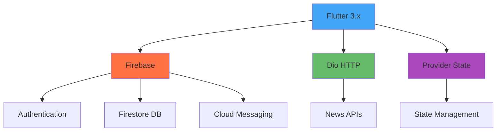

# 📱 Aplikasi Berita - Portal Berita Modern Flutter

**Aplikasi Berita** adalah solusi terdepan untuk mengakses berita terkini dengan antarmuka elegan, fitur lengkap, dan performa optimal. Dibangun dengan Flutter untuk pengalaman lintas platform yang mulus.

<div align="center">
  
</div>

<div align="center">
  <em>Tampilan utama aplikasi dengan desain modern dan interaksi yang mulus</em>
</div>

---

## ✨ Fitur Unggulan

### 🗞️ Konten Berkualitas
- 📰 **100+ sumber berita terpercaya** (nasional & internasional)
- 🗂️ **Kategori lengkap**: Politik, Bisnis, Teknologi, Hiburan, Olahraga, Kesehatan
- ⚡ **Pembaruan real-time** dengan sistem notifikasi push
- 🎯 **Konten yang dipersonalisasi** berdasarkan preferensi

### 🛠️ Pengalaman Pengguna
- 🌗 **Dark/Light mode** otomatis (sesuai preferensi sistem)
- 🔍 **Pencarian cerdas** dengan filter multi-kriteria
- 📱 **Desain responsif** untuk berbagai ukuran layar

### 🔄 Interaksi Sosial
- 💬 **Sistem komentar bertingkat** dengan reaksi
- 📌 **Bookmark** dengan kategori custom
- 🤝 **Berbagi** ke 20+ platform media sosial
- 👤 **Profil pengguna** dengan riwayat bacaan

---

## 📸 Galeri Aplikasi

<table>
  <tr>
    <td align="center"><strong>Beranda Personalisasi</strong></td>
    <td align="center"><strong>Pembaca Artikel</strong></td>
  </tr>
  <tr>
    <td align="center">
      
    </td>
    <td align="center">
      
    </td>
  </tr>
  <tr>
    <td align="center"><strong>Manajemen Bookmark</strong></td>
    <td align="center"><strong>Profil Pengguna</strong></td>
  </tr>
  <tr>
    <td align="center">
      
    </td>
    <td align="center">
      
    </td>
  </tr>
  <tr>
    <td align="center" colspan="2"><strong>Sistem Komentar</strong></td>
  </tr>
  <tr>
    <td align="center" colspan="2">
      
    </td>
  </tr>
</table>

---

## 🚀 Instalasi Mudah

### 📱 Android - Versi Terbaru: v2.2.0

#### 🔥 **Release v2.2.0** - Update & Perbaikan Terbaru
- 🎨 **Launcher icon** aplikasi menggunakan logo FOKUS terbaru
- 🏷️ **Branding konsisten** dengan logo FOKUS di seluruh aplikasi
- 💬 **Perbaikan sinkronisasi** jumlah komentar yang lebih akurat
- 🗑️ **Auto-update counter** saat menghapus komentar
- ⚡ **Optimasi performa** tampilan komentar
- 🔄 **Update dependensi Flutter** ke versi terbaru
- 🐛 **Bug fixes** dan peningkatan stabilitas

#### 📥 Cara Instalasi:
1. 📥 **Download APK v2.2.0** dari [halaman Releases](https://github.com/Maftuuh1922/aplikasi_berita/releases/latest)
2. ⚙️ **Aktifkan** "Instalasi dari Sumber Tidak Dikenal" di pengaturan Android
3. 🖱️ **Tap file APK** untuk memulai instalasi
4. 🎉 **Buka aplikasi** dan nikmati fitur-fitur terbaru!

#### 📋 Riwayat Versi:
- **v2.2.0** (Latest) - Logo FOKUS & optimasi komentar
- **v2.1.0** - Perbaikan bug & stabilitas
- **v1.0.0** - Rilis perdana dengan fitur utama

### 🔮 Coming Soon
- 🍏 **iOS App Store** - Dalam pengembangan
- 🌐 **Versi Web PWA** - Tahap perencanaan  
- 🖥️ **Desktop App** - Konsep awal

> 💡 **Tips**: Selalu download dari [GitHub Releases](https://github.com/Maftuuh1922/aplikasi_berita/releases) resmi untuk keamanan terjamin!

---

## 👥 Tim Pengembang

<table>
  <tr>
    <td align="center">
      <br />
      <sub><b>Muhammad Maftuh</b></sub><br />
      <sub>Lead Flutter Developer</sub><br />
      <a href="https://github.com/Maftuuh1922">@Maftuuh1922</a>
    </td>
    <td align="center">
      <br />
      <sub><b>Rival Rudiana</b></sub><br />
      <sub>UI/UX Designer</sub><br />
      <a href="https://github.com/rivalrudiana1">@rivalrudiana1</a>
    </td>
    <td align="center">
      <br />
      <sub><b>Ridwan Syahini</b></sub><br />
      <sub>Backend Engineer</sub><br />
      <a href="https://github.com/rdwnsyh">@rdwnsyh</a>
    </td>
  </tr>
</table>

### 🏆 Kontribusi Tim
- **Muhammad Maftuh**: Arsitektur aplikasi, state management, optimisasi performa
- **Rival Rudiana**: Design system, user experience, prototype & testing  
- **Ridwan Ridwansyah**: API integration, database design, infrastruktur backend

---

## 🛠️ Teknologi Utama



### 🔧 Tech Stack:
- **Frontend**: Flutter 3.x, Dart, Material Design 3
- **Backend**: Firebase, REST APIs
- **Database**: Firestore
- **State Management**: Provider, GetX
- **Push Notifications**: Firebase Cloud Messaging
- **HTTP Client**: Dio
- **Authentication**: Firebase Auth

---

## 📊 Statistik Proyek

<div align="center">

[](https://github.com/Maftuuh1922/aplikasi_berita/stargazers)
[](https://github.com/Maftuuh1922/aplikasi_berita/network)
[](https://github.com/Maftuuh1922/aplikasi_berita/issues)
[](https://github.com/Maftuuh1922/aplikasi_berita/blob/main/LICENSE)

</div>

---

## 🤝 Berkontribusi

Kami sangat menghargai kontribusi dari komunitas! Berikut cara bergabung:

### 🔧 Langkah Kontribusi
1. **Fork** repository ini
2. **Clone** ke local: `git clone https://github.com/username/aplikasi_berita.git`
3. **Buat branch** fitur baru: `git checkout -b feature/nama-fitur`
4. **Commit** perubahan: `git commit -m 'Add: fitur baru'`
5. **Push** ke branch: `git push origin feature/nama-fitur`
6. **Buat Pull Request** dengan deskripsi yang jelas

### 🐛 Melaporkan Bug
Gunakan [GitHub Issues](https://github.com/Maftuuh1922/aplikasi_berita/issues) untuk melaporkan bug dengan informasi:
- Device dan versi OS
- Langkah reproduksi bug
- Screenshot jika diperlukan
- Log error (jika ada)

---

## 📋 Roadmap Pengembangan

### 🎯 Version 1.1 (Q3 2025)
- [ ] 🌍 Multi-language support (ID, EN, CN)
- [ ] 🔊 Text-to-speech feature
- [ ] 🔍 Advanced search filters
- [ ] 📊 Reading analytics & statistics
- [ ] 🌙 Enhanced dark mode themes

### 🚀 Version 1.2 (Q4 2025)
- [ ] 🍏 iOS App Store release
- [ ] 🌐 Progressive Web App (PWA)
- [ ] 📱 Offline sync improvements
- [ ] 🎨 Custom theme builder
- [ ] 🔔 Smart notification system

### 🌟 Version 2.0 (Q1 2026)
- [ ] 🖥️ Desktop application
- [ ] 🤖 AI-powered news recommendations
- [ ] 📺 Video news integration
- [ ] 🌍 Global news network expansion

---

## 🔒 Keamanan & Privasi

- 🔐 **End-to-end encryption** untuk data sensitif
- 👤 **Data pengguna** dilindungi sesuai GDPR
- 🛡️ **Regular security audits** dan penetration testing
- 📋 **Transparent privacy policy** - [Baca selengkapnya](PRIVACY.md)

---

## 📄 Lisensi

Proyek ini dilisensikan di bawah **MIT License** - lihat file [LICENSE](LICENSE) untuk detail lengkap.

```
MIT License - Bebas digunakan untuk keperluan komersial dan non-komersial
```

---

## 📞 Dukungan & Kontak

<div align="center">

📧 **Email**: [maftuhade123@gmail.com](mailto:maftuhade123@gmail.com)

💬 **GitHub Issues**: [Report Bug/Feature Request](https://github.com/Maftuuh1922/aplikasi_berita/issues)

🌐 **Website**: [Coming Soon](#)

📱 **Social Media**: [LinkedIn](#) • [Twitter](#) • [Instagram](#)

</div>

---

<div align="center">

## 🎓 Universitas Logistik Bisnis Internasional

**Dibuat dengan ❤️ oleh Tim ULBI**

*"Menghadirkan berita dunia dalam genggaman dengan elegan dan cepat"*

### ⭐ Dukung Proyek Ini

**Jika project ini bermanfaat, berikan star ⭐ untuk mendukung pengembangan selanjutnya!**

[](https://star-history.com/#Maftuuh1922/aplikasi_berita&Date)

---


</div>
