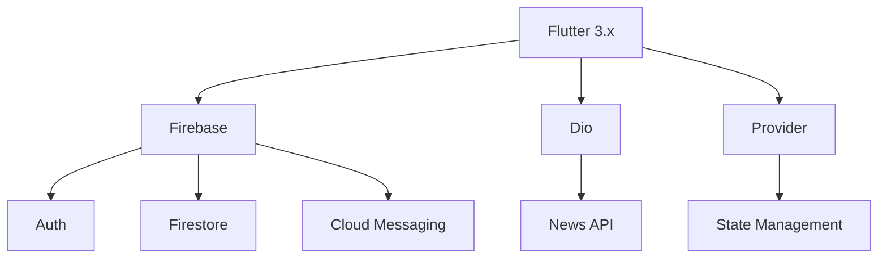

Here's an improved and more polished version of your **Aplikasi Berita** README with better structure, visuals, and professionalism:

---

# 📱 Aplikasi Berita - Portal Berita Modern Flutter

**Aplikasi Berita** adalah solusi terdepan untuk mengakses berita terkini dengan antarmuka elegan, fitur lengkap, dan performa optimal. Dibangun dengan Flutter untuk pengalaman lintas platform yang mulus.

  
*(Contoh tampilan utama aplikasi)*

## ✨ Fitur Unggulan

### 🗞️ Konten Berkualitas
- 📰 100+ sumber berita terpercaya (nasional & internasional)
- 🗂 Kategori lengkap: Politik, Bisnis, Teknologi, Hiburan, Olahraga, Kesehatan
- ⚡ Pembaruan real-time dengan sistem notifikasi

### 🛠️ Pengalaman Pengguna
- 🌗 Dark/Light mode otomatis (sesuai preferensi sistem)
- 🔍 Pencarian cerdas dengan filter multi-kriteria
- 📖 Mode baca (text-to-speech coming soon)
- 🚀 Animasi UI halus 60 FPS

### 🔄 Interaksi Sosial
- 💬 Sistem komentar bertingkat dengan reaksi
- 📌 Bookmark dengan kategori custom
- 🤝 Berbagi ke 20+ platform sosial media

## 📸 Galeri Aplikasi

| Fitur | Tampilan |
|-------|----------|
| **Beranda Personalisasi** |  |
| **Pembaca Artikel** |  |
| **Manajemen Bookmark** | 
|
| **Profil** |  |
| **Comentar** | 
 |

## 🚀 Instalasi Mudah

### Android
1. 📥 Download APK terbaru dari [halaman Releases](https://github.com/Maftuuh1922/aplikasi_berita/releases)
2. ⚙️ Aktifkan **Instalasi dari Sumber Tidak Dikenal**
3. 🖱️ Klik file APK untuk instalasi
4. 🎉 Buka aplikasi dan mulai eksplorasi!

### Coming Soon
- 🍏 App Store (iOS)
- 🖥️ Versi Web PWA

## 👨‍💻 Tim Pengembang

| | Muhammad Maftuh | Rival Rudiana | Ridwan Syahini |
|-|-----------------|---------------|-----------------|
| **Role** | Flutter Developer | UI/UX Designer | Backend Engineer |
| **Kontak** | [GitHub](https://github.com/Maftuuh1922) | [GitHub](https://github.com/rivalrudiana1) | [GitHub](https://github.com/rdwnsyh) |
| **Fokus** | Arsitektur Aplikasi | Desain Interaksi | API Integration |

## 🛠️ Teknologi Utama

## 🤝 Berkontribusi

Kami terbuka untuk kontribusi! Ikuti langkah:
1. Fork proyek
2. Buat branch fitur (`git checkout -b fitur/namafitur`)
3. Commit perubahan (`git commit -m 'Tambahkan fitur x'`)
4. Push ke branch (`git push origin fitur/namafitur`)
5. Buat Pull Request

## 📄 Lisensi
Proyek ini dilisensikan di bawah **MIT License** - lihat file [LICENSE](LICENSE) untuk detailnya.

---

