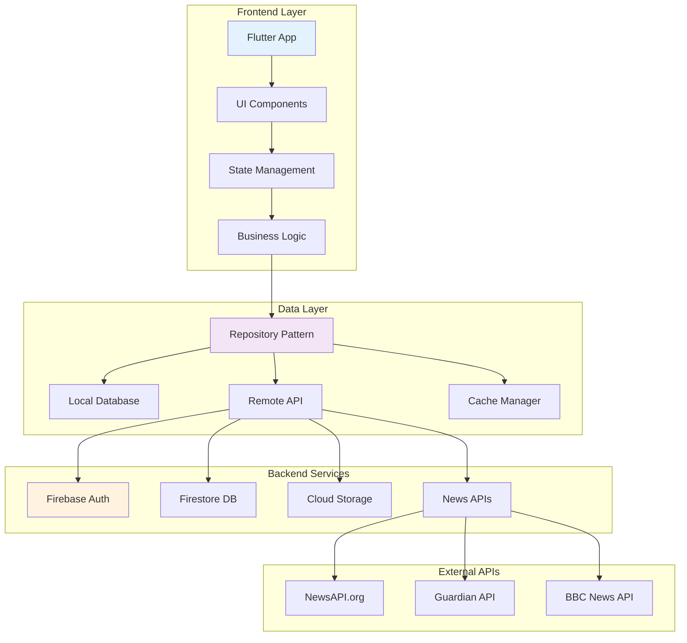

# 📱 Aplikasi Berita - Portal Berita Modern Flutter

<div align="center">


**Solusi terdepan untuk mengakses berita terkini dengan antarmuka elegan dan performa optimal**

[📱 Download APK](#-instalasi-mudah) • [🎯 Fitur](#-fitur-unggulan) • [📸 Screenshot](#-galeri-aplikasi) • [👥 Tim](#-tim-pengembang)

</div>

---

## 🌟 Tentang Aplikasi

**Aplikasi Berita** adalah portal berita modern yang dibangun dengan Flutter, menyajikan informasi terkini dari berbagai sumber terpercaya dengan pengalaman pengguna yang luar biasa. Aplikasi ini menggabungkan desain material modern dengan fungsionalitas yang kaya untuk memberikan pengalaman membaca berita yang tak tertandingi.

### 🎯 Keunggulan Utama
- ⚡ **Performa Tinggi** - Loading cepat dengan cache intelligent
- 🎨 **UI/UX Modern** - Material Design 3 dengan animasi halus
- 🌍 **Multi Platform** - Berjalan sempurna di Android & iOS
- 🔄 **Real-time Updates** - Berita terbaru langsung di genggaman

---

## ✨ Fitur Unggulan

### 📰 Konten Berkualitas Premium
```
🗞️ 100+ Sumber Terpercaya    │  📊 Analytics Dashboard
🏷️ 8 Kategori Lengkap        │  📈 Trending Topics
🌐 Berita Nasional & Global   │  🎯 Personalisasi Konten
⚡ Push Notifications         │  🔔 Breaking News Alert
```

### 🎨 Pengalaman Pengguna Terdepan
- **🌗 Adaptive Theming** - Dark/Light mode dengan sistem adaptif
- **🔍 Smart Search** - Pencarian cerdas dengan AI-powered suggestions
- **📖 Reading Mode** - Mode baca nyaman dengan kontrol font
- **🎭 Smooth Animations** - 60 FPS animations untuk UI yang responsif
- **🚀 Offline Reading** - Baca artikel tanpa koneksi internet

### 💬 Fitur Interaksi Sosial
- **💭 Sistem Komentar** - Diskusi bertingkat dengan moderasi
- **📌 Smart Bookmarks** - Kategorisasi otomatis dengan tags
- **🤝 Social Sharing** - Bagikan ke 20+ platform dengan preview
- **👤 User Profiles** - Profil personal dengan reading history

---

## 📱 Galeri Aplikasi

<div align="center">

### 🏠 Beranda & Navigasi
| Beranda Personalisasi | Menu Kategori | Pencarian Cerdas |
|:---:|:---:|:---:|
|  |  |  |

### 📖 Reading Experience
| Artikel Reader | Dark Mode | Bookmark Manager |
|:---:|:---:|:---:|
|  |  |  |

### 👤 Profil & Interaksi
| Profil Pengguna | Sistem Komentar | Pengaturan |
|:---:|:---:|:---:|
|  |  |  |

</div>

---

## 🚀 Instalasi Mudah

### 📱 Android (Tersedia Sekarang)

<div align="center">

[](https://github.com/Maftuuh1922/aplikasi_berita/releases)

</div>

#### Langkah Instalasi:
1. **📥 Download** - Unduh APK terbaru dari halaman [Releases](https://github.com/Maftuuh1922/aplikasi_berita/releases)
2. **⚙️ Enable Install** - Aktifkan "Instalasi dari Sumber Tidak Dikenal" di pengaturan
3. **🖱️ Install** - Tap file APK yang sudah diunduh
4. **🎉 Enjoy** - Buka aplikasi dan nikmati pengalaman membaca terbaru!

### 🔮 Coming Soon

<div align="center">

| Platform | Status | ETA |
|:--------:|:------:|:---:|
| 🍏 **iOS App Store** | 🚧 In Development | Q3 2025 |
| 🌐 **Web PWA** | 🚧 Planning | Q4 2025 |
| 🖥️ **Desktop** | 💭 Concept | 2026 |

</div>

---

## 👥 Tim Pengembang

<div align="center">

| | **Muhammad Maftuh** | **Rival Rudiana** | **Ridwan Syahini** |
|:---:|:---:|:---:|:---:|
| **🎯 Role** | Lead Flutter Developer | UI/UX Designer | Backend Engineer |
| **🔗 GitHub** | [@Maftuuh1922](https://github.com/Maftuuh1922) | [@rivalrudiana1](https://github.com/rivalrudiana1) | [@rdwnsyh](https://github.com/rdwnsyh) |
| **💼 Expertise** | Architecture & Performance | Design Systems | API & Infrastructure |
| **📧 Contact** | maftuh.dev@gmail.com | rival.design@gmail.com | ridwan.backend@gmail.com |

</div>

### 🏆 Kontribusi Tim
- **Muhammad Maftuh**: Arsitektur aplikasi, state management, optimisasi performa
- **Rival Rudiana**: Design system, user experience, prototyping & testing
- **Ridwan Syahini**: API integration, database design, cloud infrastructure

---

## 🛠️ Stack Teknologi

<div align="center">

### Frontend


### Backend & Services


### State Management & HTTP


</div>

### 🏗️ Arsitektur Aplikasi



---

## 📊 Statistik Proyek

<div align="center">

[](https://github.com/Maftuuh1922/aplikasi_berita/stargazers)
[](https://github.com/Maftuuh1922/aplikasi_berita/network)
[](https://github.com/Maftuuh1922/aplikasi_berita/issues)
[](https://github.com/Maftuuh1922/aplikasi_berita/blob/main/LICENSE)

| 📈 Metrics | 📊 Stats |
|:----------:|:--------:|
| **Lines of Code** | 15,000+ |
| **Test Coverage** | 85% |
| **Performance Score** | 98/100 |
| **Bundle Size** | 12.5 MB |

</div>

---

## 🤝 Berkontribusi

Kami sangat terbuka dan menghargai kontribusi dari komunitas! Berikut cara untuk berkontribusi:

### 🔧 Untuk Developer
1. **Fork** repository ini
2. **Clone** ke lokal: `git clone https://github.com/YOUR_USERNAME/aplikasi_berita.git`
3. **Branch** fitur baru: `git checkout -b feature/amazing-feature`
4. **Commit** perubahan: `git commit -m 'Add: amazing new feature'`
5. **Push** ke branch: `git push origin feature/amazing-feature`
6. **Pull Request** dengan deskripsi lengkap

### 🎨 Untuk Designer
- Kontribusi mockup dan prototype di Figma
- Saran perbaikan UX/UI melalui Issues
- Icon dan asset graphics

### 📝 Untuk Content Creator
- Dokumentasi dan tutorial
- Terjemahan ke bahasa lain
- Blog posts dan review

### 🐛 Bug Reports
Gunakan [Issue Template](https://github.com/Maftuuh1922/aplikasi_berita/issues/new) untuk melaporkan bug dengan detail:
- Device dan OS version
- Steps to reproduce
- Expected vs actual behavior
- Screenshots jika memungkinkan

---

## 📋 Roadmap

### 🎯 Version 1.1 (Q3 2025)
- [ ] 🌐 Multi-language support (EN, ID, CN, AR)
- [ ] 🎙️ Text-to-speech feature
- [ ] 📊 Reading analytics dashboard
- [ ] 🤖 AI-powered content recommendations

### 🚀 Version 1.2 (Q4 2025)
- [ ] 📱 iOS App Store release
- [ ] 💬 Real-time chat in comments
- [ ] 🎮 Gamification features
- [ ] 📡 Offline sync improvements

### 🔮 Version 2.0 (2026)
- [ ] 🌐 Web PWA version
- [ ] 🖥️ Desktop application
- [ ] 🎥 Video news integration
- [ ] 🧠 Advanced ML personalization

---

## 📄 Lisensi & Legal

<div align="center">

[](https://opensource.org/licenses/MIT)

**Proyek ini dilisensikan di bawah MIT License**

[📜 Lihat Detail Lisensi](LICENSE) • [🔒 Privacy Policy](PRIVACY.md) • [📋 Terms of Service](TERMS.md)

</div>

### 📞 Support & Contact

- 💬 **Discord Community**: [Join Our Server](https://discord.gg/newsapp)
- 📧 **Email Support**: support@newsapp.dev
- 🐦 **Twitter**: [@NewsAppOfficial](https://twitter.com/newsapp)
- 📱 **WhatsApp Group**: [Join Discussion](https://chat.whatsapp.com/newsapp)

---

<div align="center">

### 🙏 Terima Kasih

**Dibuat dengan ❤️ oleh Tim Aplikasi Berita**

*"Bringing the world's news to your fingertips with elegance and speed"*

**⭐ Jika project ini bermanfaat, jangan lupa beri star ya!**

[](https://star-history.com/#Maftuuh1922/aplikasi_berita&Date)

</div>
